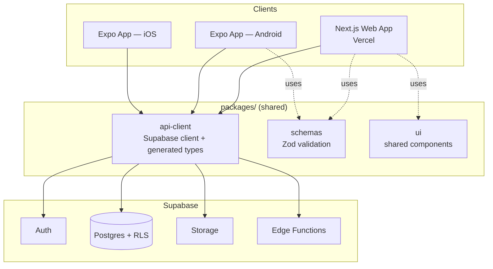

# Stack Playbook — React + Supabase + Vercel (Web → Android → iOS)

Reusable per-app template. See `.claude/portfolio-tracker-architecture.md` §7 and
`.claude/Execution_Roadmap.md` for how this has actually been applied to
Portfolio Tracker specifically — this file stays generic/reusable on purpose.

---

## 0. STANDING ASSUMPTIONS (override per-project if wrong)

- **Web**: Next.js (App Router), TypeScript, Tailwind, shadcn/ui, deployed on Vercel.
- **Mobile**: React Native via **Expo** (not bare RN) — shared logic with web, single
  codebase for Android + iOS, EAS Build/Submit for store delivery. If a feature needs a
  native module Expo doesn't support (rare), that's a documented exception, not a reason
  to abandon Expo project-wide.
- **Backend**: Supabase — Postgres, Auth, Storage, Edge Functions, Row Level Security (RLS)
  as the default authorization mechanism, not app-layer checks alone.
- **Repo shape**: monorepo (Turborepo), not separate repos per platform. Rationale: you're
  explicitly sequencing web → Android → iOS on shared logic; separate repos would mean
  re-implementing the data layer twice. Revisit only if team size/ownership genuinely
  splits by platform later.
- **Why this over alternatives** (stated once, not re-litigated per project):
  - vs. Firebase: Supabase gives you Postgres + SQL + RLS instead of a NoSQL document
    model — better fit if your data has real relations, which most non-trivial apps do.
  - vs. bare React Native / native Kotlin+Swift: Expo trades a small ceiling on deep
    native access for a large speed win on a 3-person-or-fewer team shipping two mobile
    platforms from one codebase. Reconsider only if a specific native capability
    (background processing, exotic sensors) becomes a hard requirement.

---

## 1. REPO BOILERPLATE STRUCTURE

```
/apps
  /web          → Next.js app (Vercel)
  /mobile       → Expo app (EAS)
/packages
  /ui           → shared React components (web + RN where feasible via shared primitives)
  /config       → eslint, tsconfig, tailwind config, shared constants
  /api-client   → Supabase client instance, generated types, query hooks (TanStack Query)
  /schemas      → Zod schemas — single source of truth for validation, shared web+mobile
/supabase
  /migrations   → SQL migrations (Supabase CLI managed)
  /functions    → Edge Functions
turbo.json
package.json
```

Init checklist (run once per new project):
- [ ] `npx create-turbo@latest` → scaffold monorepo
- [ ] `apps/web`: Next.js + TS + Tailwind + shadcn/ui
- [ ] `apps/mobile`: `npx create-expo-app` with TS template, Expo Router
- [ ] `packages/api-client`: single Supabase client factory, env-driven (dev/staging/prod)
- [ ] `packages/schemas`: Zod schemas for core entities, imported by both apps
- [ ] Supabase CLI installed, linked to project, `supabase/migrations` initialized
- [ ] `supabase gen types typescript` wired into a script — regenerate types on every
      schema change, never hand-write DB types
- [ ] Three Supabase environments: dev, staging, prod (or dev + prod for small projects) —
      never point local dev at the prod project
- [ ] RLS enabled by default on every table from migration #1, not bolted on later
- [ ] Vercel project linked to `apps/web`, auto-deploy on main + preview deploys on PRs
- [ ] EAS project configured (`eas.json`) with dev/preview/production build profiles
- [ ] **Root `package.json` needs a `packageManager` field (or `devEngines.packageManager`)
      for Turborepo to resolve the workspace correctly — confirmed this is required for
      Vercel builds specifically, not just a local nicety**
- [ ] **Watch for `create-expo-app` auto-initializing its own nested `.git` inside
      `apps/mobile` — remove it (`rm -rf apps/mobile/.git`) before your first commit at
      the monorepo root, or `git add .` will fail treating it as an unresolved submodule**
- [ ] **Confirm every app's own `.gitignore` actually ignores plain `.env`, not just
      `.env*.local` — Expo's default template only covers the latter**

---

## 2. ARCHITECTURE OVERVIEW



Both mobile platforms share one Expo codebase, so "Android then iOS" is mostly a
**store-submission and device-testing sequence**, not a re-architecture — the app itself
doesn't get rebuilt between them.

---

## 3. PHASE SEQUENCE (maps onto `Execution_Roadmap.md` §1 Phase Ledger)

### Phase 0 — Wireframe
- Low-fidelity wireframes (Figma, or quick AI-assisted mockups) before the intake form —
  the roadmap already notes MVP definition should precede the first intake pass.
- Output: enough screens/flows to answer the intake form's Functional Requirements section
  concretely, not just in prose.

### Phase 1 — Repo Init (this playbook's §1 checklist)
- One sitting, boilerplate only. No feature code yet.
- Gate: `apps/web` deploys an empty page to Vercel, `apps/mobile` runs in Expo Go, both
  read from the same Supabase project. If this doesn't work end-to-end, don't proceed.

### Phase 2 — Web MVP
- Auth (Supabase Auth — magic link or OAuth, pick one, don't build both "just in case")
- Core data model migrated with RLS policies written alongside the tables, not after
- Core user flow from wireframes, deployed to Vercel preview per PR
- Gate: a real user can complete the core flow on the web app

### Phase 3 — Android
- Same codebase (`apps/mobile`) targeting Android first — catches platform bugs before
  doubling the surface with iOS
- EAS Build → internal testing track (Play Console)
- Gate: core flow works on 2-3 real Android devices/OS versions, not just emulator

### Phase 4 — iOS
- Same codebase, iOS-specific fixes only (safe-area, permissions prompts, platform UI
  conventions)
- Requires Apple Developer account — flag this as a Decide-Before-Building item if not
  already set up, since enrollment can take days
- EAS Build → TestFlight
- Gate: core flow works on physical iOS device

### Phase 5 — Production Readiness
- Use `Execution_Roadmap.md` §4 as-is (security, observability, backup/DR, load test,
  rollback). Nothing stack-specific to add here beyond: verify RLS policies under
  concurrent load, not just correctness — RLS mistakes fail silently as "no rows returned,"
  not as errors.

---

## 4. DEFAULT ENTRIES FOR `Execution_Roadmap.md` §3 CROSS-CUTTING TRACKS

Pre-fill these into the Tech Decisions Log and Debt & Lock-in Register per project so
they're not re-derived each time:

**Tech decisions log (defaults):**
- Supabase over Firebase — relational data, RLS as auth boundary
- Expo over bare RN — shared codebase, faster ship, accepted ceiling on native access
- Turborepo monorepo — shared types/schemas across web + mobile from day one

**Debt & lock-in register (defaults, review at every gate):**
- Supabase lock-in: Postgres underneath is portable; Auth/Storage/Edge Functions are not —
  migration cost grows with Edge Function usage specifically
- Expo lock-in: low until a native module forces an eject to bare workflow — watch for
  this trigger explicitly, don't let it surprise you mid-build
- RLS complexity: policies are easy to under-scope early and only fail visibly under
  multi-tenant load — revisit trigger: first feature involving shared/team data, not solo
  user data

---

## 5. WORKFLOW SUMMARY

```
Wireframe → 02-intake-form.md (standard) → design agreed
    → this playbook §1 (repo init)
    → Execution_Roadmap.md §0 (MVP definition) + §1 (phase ledger, phases from §3 above)
    → per-phase: 02-intake-form.md (stress-test variant) when extending, standard when
      requirements genuinely change shape
    → Execution_Roadmap.md §4 (production readiness stress-test) before GA
```
